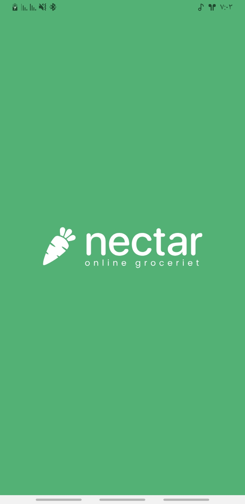
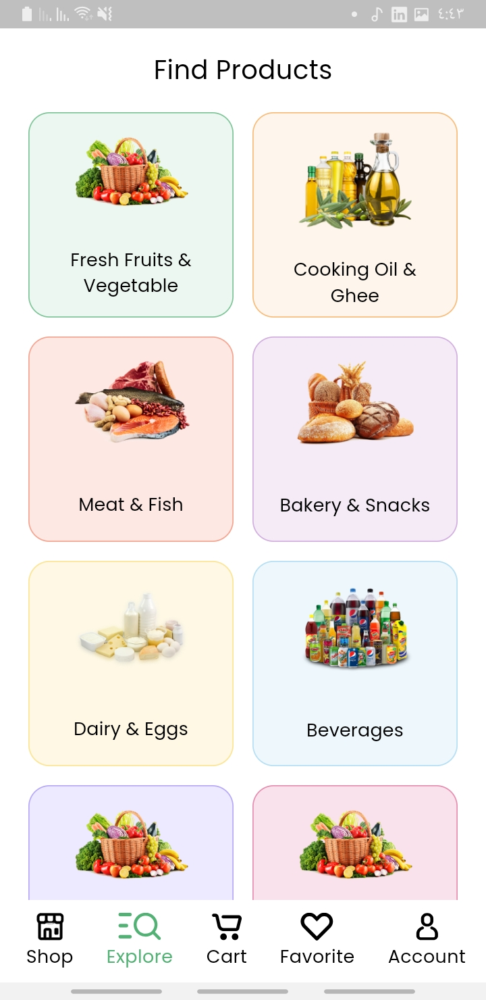
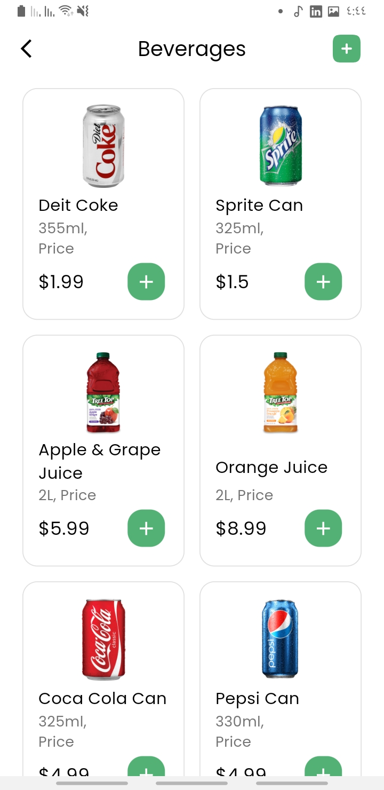
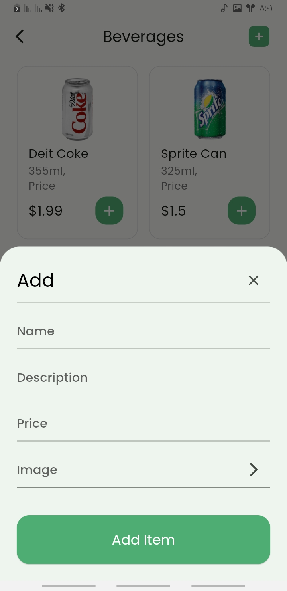
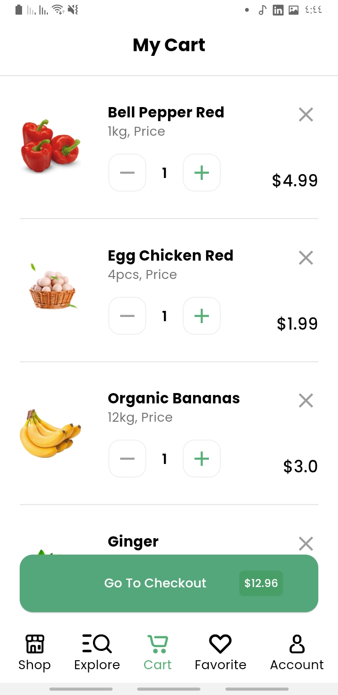
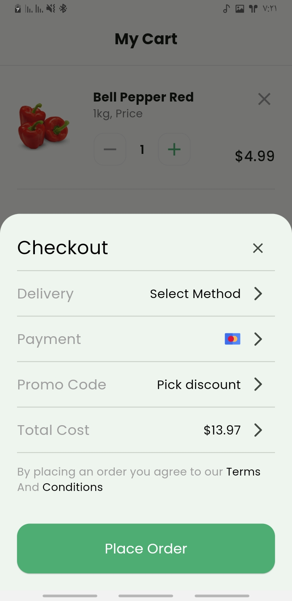
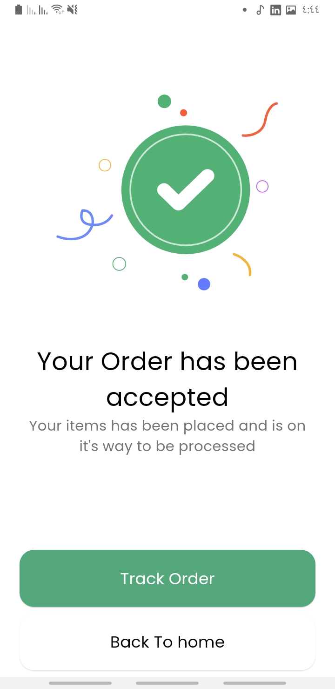

# Nectar Online Grocery App

Welcome to the Nectar Online Grocery App repository! This app provides a convenient and user-friendly interface for online grocery shopping, allowing users to order their groceries and get them delivered in as fast as one hour.

## Table of Contents

- [Features](#features)
- [Screenshots](#screenshots)
- [Installation](#installation)
- [Usage](#usage)
- [Contributing](#contributing)
- [License](#license)

## Features

- **User-friendly Interface**: Easy navigation and clean design for a seamless shopping experience.
- **Product Categories**: Browse through various categories like Fresh Fruits & Vegetables, Cooking Oil & Ghee, Meat & Fish, Bakery & Snacks, Dairy & Eggs, and Beverages.
- **Product Details**: View detailed information for each product including volume and price.
- **Cart Management**: Add products to your cart, update quantities, and view total cost.
- **Checkout**: Simple checkout process with delivery and payment options.
- **Order Tracking**: Track your order status after placing it.
- **Account Management**: Manage your profile and view order history.

## Screenshots

### Splash Screen


### Welcome Screen


### Explore Screen


### Beverages Screen


### Add Item Screen


### Cart Screen


### Checkout Screen


### Order Confirmation Screen


## Installation

To get a local copy of the app up and running, follow these simple steps.

### Prerequisites

- [Flutter](https://flutter.dev) installed on your local machine.
- A code editor like [Visual Studio Code](https://code.visualstudio.com/) or [Android Studio](https://developer.android.com/studio).

### Steps

1. **Clone the repository**:
    ```sh
    git clone https://github.com/your-username/nectar-app.git
    ```

2. **Navigate to the project directory**:
    ```sh
    cd nectar-app
    ```

3. **Install the dependencies**:
    ```sh
    flutter pub get
    ```

4. **Run the app**:
    ```sh
    flutter run
    ```

## Usage

- **Explore Products**: Browse products by categories from the home screen.
- **Add to Cart**: Select products and add them to your cart.
- **Manage Cart**: Adjust quantities or remove items from your cart.
- **Checkout**: Proceed to checkout by selecting delivery and payment methods.
- **Track Order**: After placing an order, track its status from the order confirmation screen.

## Contributing

Contributions are what make the open-source community such an amazing place to learn, inspire, and create. Any contributions you make are **greatly appreciated**.

1. Fork the Project
2. Create your Feature Branch (`git checkout -b feature/AmazingFeature`)
3. Commit your Changes (`git commit -m 'Add some AmazingFeature'`)
4. Push to the Branch (`git push origin feature/AmazingFeature`)
5. Open a Pull Request

## License

Distributed under the MIT License. See `LICENSE` for more information.


